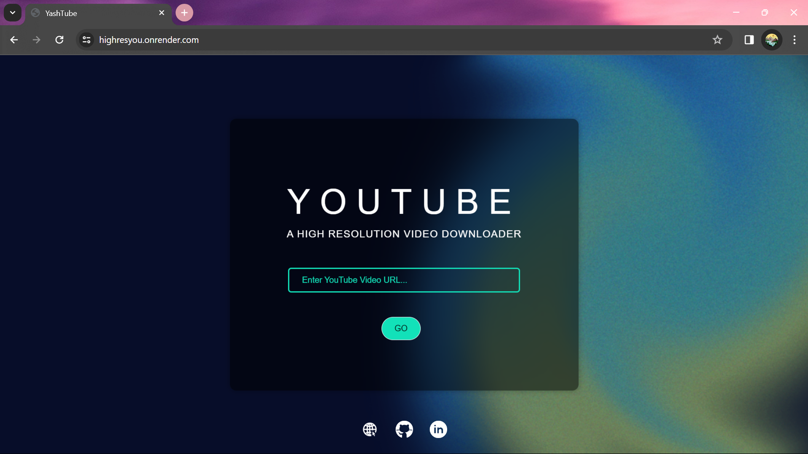

# YouTube Video Downloader

- Hosted link: https://highresyou.onrender.com

## Overview

I made a YouTube Video Downloader which is a web application that allows users to download videos from YouTube in high quality.

## Features

- Download videos from YouTube in MP4 format.
- High-resolution video downloads.
- Easy-to-use interface.

## How I made It

1. For backened: I used python and it's very popular framework called 'Flask'. Is easy and beginner friedndly. I got everything in it for my this use case. I may use some other languages as backened in future but for my first introduction to the web dev I find it usefull.

2. For Frontend: For frontend I used html and css. I already have some html skills and I brush them up in this project but the css and a little bit of javascript was new for me which I learned according to necessity of this project.

## Dependencies

- Flask
- requests
- pytube

## Run it in your local:

1. Clone the repository: `git clone https://github.com/MehraYash524/WebDevOb.git`
2. Install the required dependencies: `pip install -r requirements.txt`
3. Run the application: `python app.py`
4. Access the application in your web browser at `http://localhost:5000` or `http://127.0.0.1:5000/` or anything your flask tells you.

## Usage

1. Enter the YouTube video URL in the input field.
2. Click the "Download" button to start downloading the video.
3. The downloaded video will be saved in the default directory on your device.

